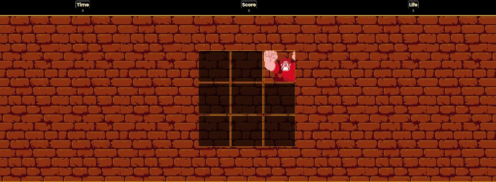

# Jogo 2D - Detona Ralph

Bem-vindo ao projeto do jogo 2D de Detona Ralph! Este projeto é uma recriação simplificada do famoso jogo do filme "Detona Ralph", desenvolvido utilizando JavaScript, HTML e CSS. Ele foi criado com o objetivo de praticar desenvolvimento de jogos com tecnologias web e proporcionar uma experiência de nostalgia para os fãs do filme.

## Tecnologias Utilizadas

- **JavaScript**: Programação da lógica do jogo, incluindo movimentação dos personagens, colisões e controle dos eventos do jogo.
- **HTML5**: Estruturação do layout e elementos visuais do jogo.
- **CSS3**: Estilização dos elementos e layout para uma apresentação mais atraente.

## Funcionalidades

- **Pontuação**: O jogo mantém o controle da pontuação do jogador com base nas janelas quebradas.

## Como Executar o Projeto

1. Clone o repositório para o seu ambiente local:
    ```bash
    git clone https://github.com/MyckaelAndrade/jsgame-detona-ralph.git
    ```

2. Abra o arquivo `index.html` no seu navegador para começar a jogar.

## Estrutura do Projeto

- `index.html`: Arquivo principal que contém a estrutura HTML do jogo.
- `style.css`: Arquivo de estilo que define a aparência do jogo.
- `script.js`: Arquivo JavaScript que contém a lógica do jogo, incluindo movimentação e eventos.
- `assets/`: Contém imagens e sons utilizados no jogo.

## Capturas de Tela

### Gameplay


## Contribuição

Se você deseja contribuir para o desenvolvimento deste projeto, fique à vontade para abrir uma issue ou enviar um pull request com melhorias.

## Licença

Este projeto está licenciado sob a licença MIT. Consulte o arquivo `LICENSE` para mais detalhes.

---

Desenvolvido como parte de um projeto de aprendizagem da [Digital Innovation One](https://digitalinnovation.one).
